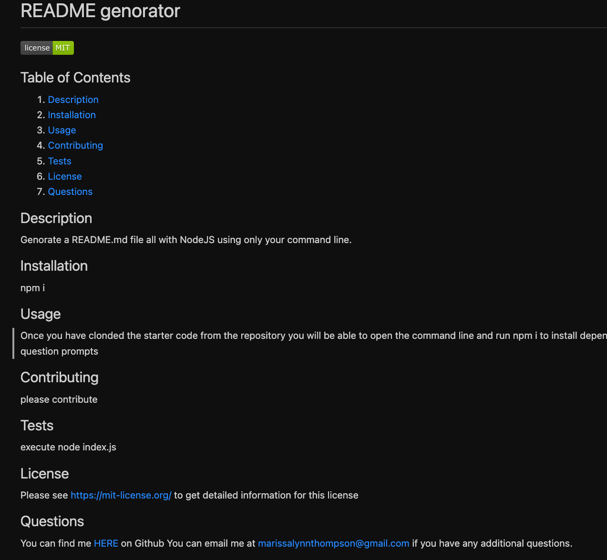

# <Module9-README>

## Description

With this project you are able to create a README.md file using NodeJS and following prompts in the command line.

## Table of Contents

- [Installation](#installation)
- [Usage](#usage)
- [Credits](#credits)
- [License](#license)

## Installation

You will need to make sure you have NodeJS installed onto your computer. 
To install this project clone the code from the GitHub repository to your local system. Once you have cloned succesfully, install inquirer v.8.2.4 by running "npm install inquirer@8.2.4" in your terminal.

## Usage

Once everything has been installed you can run node index.js in your terminal. You will then have a series of questions to answer and once you have answered them all you will have a README.md file genorated for you and added to your local repository. 

Below is a screen shot example of what your README file will look like

## Credits

Starter code from Coding Boot Camp gitlab.

Coursework from Coding Boot Camp module 9 referenced for additional guidance.

inquirer v.8.2.4 installed to run prompts.

## License

This repository is licensed under the [MIT license](https://choosealicense.com/licenses/mit/).

---

## Badges

## How to Contribute

  To suggest an idea or report a bug, please create an issue. Or, submit a pull request from your fork to the original repository for review.

## Tests

n/a